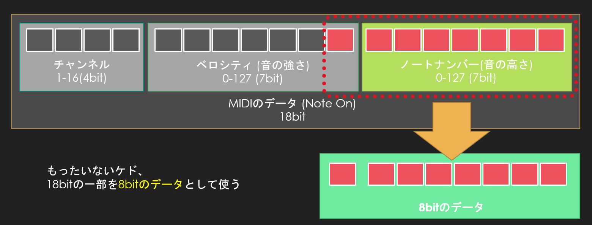

# UdonSerial - うどんシリアル

VRChatのワールドとローカルPCのシリアルポートとの間で、シリアル通信をするためのサンプルコードです。

VRChat側へデータ入力はMIDI、VRChatからのデータ出力はoutputlogを使用しており、中継するソフトウェア(python)で、シリアルポートからMIDIへのデータ変換と、outputlogからシリアルポートへのデータ変換を行います。

- UdonSerial : VRChatのワールド用のUnity用のアセット(スクリプト)
- com2vrchat : ゲートウェイソフトウェア(python)


- サンプルワールド01 ：Udon Serial Echo  
https://vrchat.com/home/world/wrld_9155f164-4834-47a9-b1c2-ca01d036f6e3

- サンプルワールド02 ：Udon Terminal  
https://vrchat.com/home/world/wrld_eb3f8774-b713-41d6-8df1-fbbe84c489db

## 注意

- 上記のサンプルワールドを含め、動作確認のためには一連の動きを理解いただく必要があります。また、どうさのためには、MIDIをループバックするために、仮想MIDIドライバ ([loopMIDI](https://www.tobias-erichsen.de/software/loopmidi.html))を使用します。  

## Tips

- 双方向のシリアル通信のためには、loopMIDIを使っていただく必要があり、ちょっと大がかりですが、ワールドからローカルへバイナリデータを出力(保存)するために使っていただく目的でご利用いただいても面白いかもしれません。


# 開発環境

- Unity 2019.4.31f1
- python 3.7 on Visual Studio 2019
- Udon Sharp v0.20.3
- VRCSDK3 2021.09.30.16.18

- MIDIをループバックするために、仮想MIDIドライバ (loopMIDI)を使用します。  
https://www.tobias-erichsen.de/software/loopmidi.html


# pythonコードの使い方

```python
# VRChatの現行のワールドログ
filename = 'C:\\Users\\(ユーザー名)\\AppData\\LocalLow\\VRChat\\VRChat\\output_log_XX-XX-XX.txt'
```

この部分を現在、joinしているVRChatログのパスに書き換えます

```python
# 接続したいCOMポートを選択
comport = serial.Serial('COM1', baudrate=115200, parity=serial.PARITY_NONE)
```

この部分を、使用したいシリアルポートのCOM番号に書き換えます。

```python
# 直前のMIDIポート一覧から仮想デバイスのポート(自分の環境では「IAC Driver My Port」)のIDを確認して、その数値にしてください
midiout = m.Output(3)
```

お使いの環境に合わせて、Loop MIDIの入力ポートの番号を設定します。

# UdonSerialの実装 (Arduinoライク)

関数一覧 (関数の詳細は[Udon SerialのReadme.md](./UdonSerial/README.md)にて)

- Serial_write(byte send_data) – 1byte送信
- Serial_print(string send_data) – 文字列送信
- Serial_println(string send_data) – 文字列送信(改行付き)
- bool Serial_available() – 受信バッファの確認
- byte Serial_read() – 1byteデータ受信
- byte Serial_peek() – 1byteデータ受信
- void Serial_flush() – 受信バッファクリア
- void setup() - World読み込み時に一度だけ呼ばれる関数
- void loop() - 毎フレーム呼ばれる関数


# ローカルPCからワールドへのMIDIデータ仕様

バイトデータからMIDIへのエンコード・デコードに関しては、ソースコード内で完結しているため、仕様を理解する必要はありませんが、下記の通りとなっております。



# ワールドからローカルPCへのDebagLogデータ書式

下記の関数で出力された、1byteのデータもしくは文字列は、16進数に変換されて、DebagLogに出力されます。

1. Serial_writeで、'A'を出力した場合
```
OUTPUT_DATA[41]
```

2. Serial_printで、"Hello World"を出力した場合
```
OUTPUT_DATA[48656C6C6F20576F726C64]
```

3. Serial_printlnで、"Hello World"を出力した場合
```
OUTPUT_DATA[48656C6C6F20576F726C640D0A]
```

# 履歴
2022/03/20 : とりあえず、リリース

# Author
- Micchy  
http://dream-drive.net  
https://twitter.com/Dream_Drive

なにかUdon Serialを拡張して楽しいネタ、これを利用して何か連動させたい案件などありましたら、趣味・お仕事問わず、ご連絡いただけましたら対応させていただきます。

# License
This is under MIT License.
