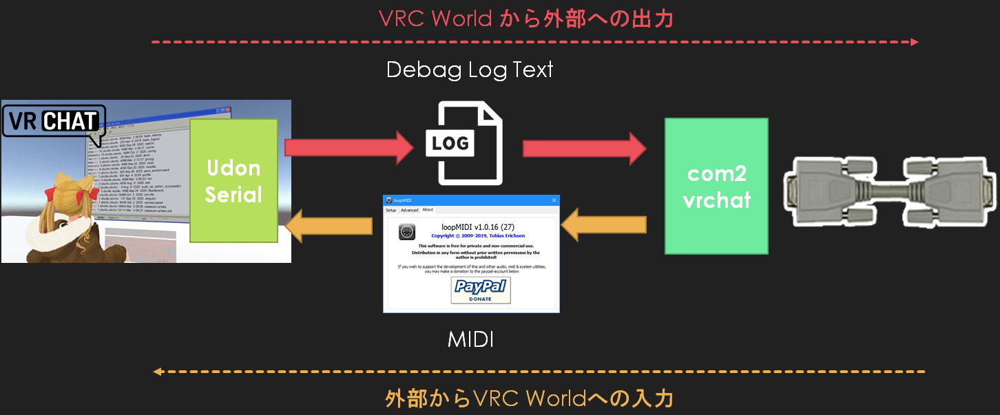

# UdonSerial - うどんシリアル

VRChatのワールドとローカルPCのシリアルポートとの間で、シリアル通信をするためのコードです。

VRChat側へデータ入力はMIDI、VRChatからのデータ出力はoutputlogを使用しており、中継するソフトウェア(python)で、シリアルポートからMIDIへのデータ変換と、outputlogからシリアルポートへのデータ変換を行います。

- UdonSerial : VRChatのワールド用のUnity用のアセット(スクリプト)
- com2vrchat : ゲートウェイソフトウェア(python)



- サンプルワールド01 ：Udon Serial Echo  
https://vrchat.com/home/world/wrld_9155f164-4834-47a9-b1c2-ca01d036f6e3

- サンプルワールド02 ：Udon Terminal  
https://vrchat.com/home/world/wrld_eb3f8774-b713-41d6-8df1-fbbe84c489db


# 開発環境

- Unity 2019.4.31f1
- python 3.7 on Visual Studio 2019
- Udon Sharp v0.20.3
- VRCSDK3 2021.09.30.16.18

- MIDIをループバックするために、仮想MIDIドライバ (loopMIDI)を使用します。  
https://www.tobias-erichsen.de/software/loopmidi.html

# pythonコードの使い方

```python
# VRChatの現行のワールドログ
filename = 'C:\\Users\\(ユーザー名)\\AppData\\LocalLow\\VRChat\\VRChat\\output_log_XX-XX-XX.txt'
```

この部分を現在、joinしているVRChatログのパスに書き換えます

```python
# 接続したいCOMポートを選択
comport = serial.Serial('COM1', baudrate=115200, parity=serial.PARITY_NONE)
```

この部分を、使用したいシリアルポートのCOM番号に書き換えます。

```python
# 直前のMIDIポート一覧から仮想デバイスのポート(自分の環境では「IAC Driver My Port」)のIDを確認して、その数値にしてください
midiout = m.Output(3)
```

お使いの環境に合わせて、Loop MIDIの入力ポートの番号を設定します。

# UdonSerialの実装 (Arduinoライク)

関数一覧 (関数の詳細はUdon SerialのReadme.mdにて)
- Serial_write(byte send_data)
- Serial_print(string send_data)
- Serial_println(string send_data)
- bool Serial_available() 
- byte Serial_read()
- byte Serial_peek()
- void Serial_flush()
- void setup()
- void loop()

# データ仕様
## MIDIデータ仕様

バイトデータからMIDIへのエンコード・デコードに関しては、ソースコード内で完結しているため、仕様を理解する必要はありませんが、下記の通りとなっております。


## DebagLogデータ仕様(書式)

OUTPUT_DATA[]